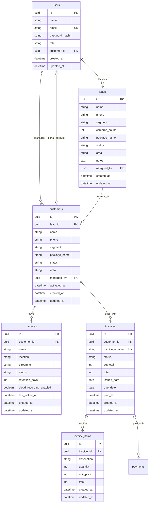

# Naltech CCTV Cloud Database Schema

Dokumen ini mendefinisikan rancangan awal database untuk platform Naltech CCTV Cloud. Tujuannya adalah membuat alur dari lead masuk, follow-up sales, aktivasi pelanggan, monitoring kamera, sampai billing bulanan.

Rekomendasi database awal: PostgreSQL.

Rekomendasi ORM: Prisma.

## Entity Relationship



## Tables

### users

Menyimpan akun internal dan akun pelanggan.

| Column | Type | Required | Notes |
| --- | --- | --- | --- |
| `id` | UUID | Yes | Primary key |
| `name` | String | Yes | Nama user |
| `email` | String | Yes | Unique |
| `password_hash` | String | Yes | Hash password, bukan password asli |
| `role` | Enum | Yes | `admin`, `sales`, `technician`, `customer` |
| `created_at` | DateTime | Yes | Auto generated |
| `updated_at` | DateTime | Yes | Auto updated |

Role awal:

```ts
type UserRole = "admin" | "sales" | "technician" | "customer";
```

### leads

Menyimpan data prospek dari landing page atau input admin.

| Column | Type | Required | Notes |
| --- | --- | --- | --- |
| `id` | UUID | Yes | Primary key |
| `name` | String | Yes | Nama calon pelanggan |
| `phone` | String | No | Nomor WhatsApp |
| `segment` | String | Yes | Toko, gudang, kantor, kos, rumah, dll |
| `cameras_count` | Integer | Yes | Estimasi jumlah kamera |
| `package_name` | Enum | Yes | `Basic`, `Standard`, `Pro` |
| `status` | Enum | Yes | Status follow-up |
| `area` | String | Yes | Kota/area layanan |
| `notes` | Text | No | Catatan kebutuhan |
| `assigned_to` | UUID | No | User sales yang handle lead |
| `created_at` | DateTime | Yes | Auto generated |
| `updated_at` | DateTime | Yes | Auto updated |

Status lead:

```ts
type LeadStatus =
  | "Baru"
  | "Menunggu follow-up"
  | "Follow-up"
  | "Survey dijadwalkan"
  | "Pilot aktif"
  | "Tidak lanjut";
```

Business rule:

- Lead baru dari landing page default status `"Baru"`.
- Lead dengan status `"Pilot aktif"` bisa dikonversi menjadi customer.
- Lead dengan status `"Tidak lanjut"` tidak masuk pipeline aktif.

### customers

Menyimpan pelanggan yang sudah aktif atau dalam onboarding.

| Column | Type | Required | Notes |
| --- | --- | --- | --- |
| `id` | UUID | Yes | Primary key |
| `lead_id` | UUID | No | Relasi ke lead asal |
| `name` | String | Yes | Nama pelanggan |
| `phone` | String | No | Nomor utama pelanggan |
| `segment` | String | Yes | Jenis lokasi |
| `package_name` | Enum | Yes | `Basic`, `Standard`, `Pro` |
| `status` | Enum | Yes | Status pelanggan |
| `area` | String | Yes | Area pelanggan |
| `managed_by` | UUID | No | User internal yang mengelola |
| `activated_at` | DateTime | No | Terisi saat customer aktif |
| `created_at` | DateTime | Yes | Auto generated |
| `updated_at` | DateTime | Yes | Auto updated |

Status customer:

```ts
type CustomerStatus = "onboarding" | "active" | "paused" | "cancelled";
```

Business rule:

- Customer dibuat dari lead saat status lead menjadi `"Pilot aktif"`.
- Customer `active` bisa memiliki kamera dan invoice aktif.
- Customer `paused` tidak otomatis dibuatkan invoice baru.

### cameras

Menyimpan kamera yang terhubung ke layanan cloud recording.

| Column | Type | Required | Notes |
| --- | --- | --- | --- |
| `id` | UUID | Yes | Primary key |
| `customer_id` | UUID | Yes | Pemilik kamera |
| `name` | String | Yes | Contoh: Kasir 01 |
| `location` | String | Yes | Lokasi/area kamera |
| `stream_url` | String | No | URL RTSP/HLS/internal stream |
| `status` | Enum | Yes | `online`, `offline`, `maintenance` |
| `retention_days` | Integer | Yes | 7, 14, 30, dst |
| `cloud_recording_enabled` | Boolean | Yes | Kamera masuk cloud recording atau tidak |
| `last_online_at` | DateTime | No | Terakhir online |
| `created_at` | DateTime | Yes | Auto generated |
| `updated_at` | DateTime | Yes | Auto updated |

Status kamera:

```ts
type CameraStatus = "online" | "offline" | "maintenance";
```

Business rule:

- Kamera aktif cloud harus punya `cloud_recording_enabled = true`.
- Retensi mengikuti paket, tapi bisa dioverride per kamera jika dibutuhkan.
- Kamera offline tetap muncul di dashboard untuk follow-up teknis.

### invoices

Menyimpan invoice bulanan pelanggan.

| Column | Type | Required | Notes |
| --- | --- | --- | --- |
| `id` | UUID | Yes | Primary key |
| `customer_id` | UUID | Yes | Customer yang ditagih |
| `invoice_number` | String | Yes | Unique, contoh `INV-2026-05-001` |
| `status` | Enum | Yes | Status pembayaran |
| `subtotal` | Integer | Yes | Dalam rupiah |
| `total` | Integer | Yes | Dalam rupiah |
| `issued_date` | Date | Yes | Tanggal invoice dibuat |
| `due_date` | Date | Yes | Jatuh tempo |
| `paid_at` | DateTime | No | Terisi saat lunas |
| `created_at` | DateTime | Yes | Auto generated |
| `updated_at` | DateTime | Yes | Auto updated |

Status invoice:

```ts
type InvoiceStatus = "draft" | "unpaid" | "paid" | "overdue" | "cancelled";
```

Business rule:

- Invoice dibuat hanya untuk customer `active`.
- Invoice bisa punya banyak item.
- Invoice dianggap `overdue` jika belum paid dan melewati `due_date`.

### invoice_items

Menyimpan detail item tagihan dalam invoice.

| Column | Type | Required | Notes |
| --- | --- | --- | --- |
| `id` | UUID | Yes | Primary key |
| `invoice_id` | UUID | Yes | Relasi ke invoice |
| `description` | String | Yes | Contoh: Cloud recording Standard 8 kamera |
| `quantity` | Integer | Yes | Jumlah unit/kamera |
| `unit_price` | Integer | Yes | Harga per kamera |
| `total` | Integer | Yes | `quantity * unit_price` |
| `created_at` | DateTime | Yes | Auto generated |
| `updated_at` | DateTime | Yes | Auto updated |

Business rule:

- Total item dihitung dari `quantity * unit_price`.
- Subtotal invoice adalah total seluruh invoice item.

### payments

Menyimpan transaksi pembayaran penuh atau parsial untuk setiap invoice.

| Column | Type | Required | Notes |
| --- | --- | --- | --- |
| invoice_id | UUID | Yes | Relasi ke invoice |
| amount | Integer | Yes | Nominal pembayaran dalam rupiah |
| method | Enum | Yes | Transfer bank, tunai, e-wallet, atau lainnya |
| reference | String | No | Nomor referensi transaksi |
| notes | String | No | Catatan internal |
| paid_at | DateTime | Yes | Waktu pembayaran |

Business rule:

- Akumulasi pembayaran tidak boleh melebihi total invoice.
- Invoice menjadi paid ketika akumulasi pembayaran mencapai total invoice.
- Menghapus pembayaran akan menghitung ulang saldo dan status invoice.

## Package Pricing

Harga awal per kamera per bulan:

| Package | Retention | Price |
| --- | ---: | ---: |
| Basic | 7 hari | Rp45.000 |
| Standard | 14 hari | Rp65.000 |
| Pro | 30 hari | Rp110.000 |

Catatan:

- Harga bisa dipindah ke tabel `packages` pada fase berikutnya.
- Untuk tahap awal, harga masih bisa dikelola di kode.

## Main Data Flow

### 1. Lead Masuk

Landing page membuat lead baru.

```text
landing form -> leads(status: Baru)
```

### 2. Sales Follow-Up

Admin/sales mengubah status lead.

```text
Baru -> Menunggu follow-up -> Follow-up -> Survey dijadwalkan
```

### 3. Aktivasi Customer

Saat status lead menjadi `"Pilot aktif"`, sistem membuat customer.

```text
leads(status: Pilot aktif) -> customers(status: active)
```

### 4. Kamera Ditambahkan

Teknisi/admin menambahkan kamera ke customer.

```text
customers -> cameras
```

### 5. Invoice Bulanan

Sistem membuat invoice dari customer aktif.

```text
customers(active) -> invoices -> invoice_items
```

## Recommended Indexes

Indexes awal:

- `users.email`
- `leads.status`
- `leads.created_at`
- `leads.assigned_to`
- `customers.status`
- `customers.lead_id`
- `cameras.customer_id`
- `cameras.status`
- `invoices.customer_id`
- `invoices.invoice_number`
- `invoices.status`
- `invoices.due_date`
- `invoice_items.invoice_id`

## Prisma Model Draft

Draft ini belum harus langsung dipakai, tapi bisa menjadi dasar saat install Prisma.

```prisma
enum UserRole {
  admin
  sales
  technician
  customer
}

enum PackageName {
  Basic
  Standard
  Pro
}

enum LeadStatus {
  Baru
  MenungguFollowUp
  FollowUp
  SurveyDijadwalkan
  PilotAktif
  TidakLanjut
}

enum CustomerStatus {
  onboarding
  active
  paused
  cancelled
}

enum CameraStatus {
  online
  offline
  maintenance
}

enum InvoiceStatus {
  draft
  unpaid
  paid
  overdue
  cancelled
}

model User {
  id           String     @id @default(uuid())
  name         String
  email        String     @unique
  passwordHash String
  role         UserRole
  customerId   String?    @unique
  customer     Customer?  @relation("CustomerPortalUser", fields: [customerId], references: [id])
  leads        Lead[]     @relation("LeadAssignee")
  customers    Customer[] @relation("CustomerManager")
  createdAt    DateTime   @default(now())
  updatedAt    DateTime   @updatedAt

  @@index([customerId])
}

model Lead {
  id           String      @id @default(uuid())
  name         String
  phone        String?
  segment      String
  camerasCount Int
  packageName  PackageName
  status       LeadStatus  @default(Baru)
  area         String
  notes        String?
  assignedToId String?
  assignedTo   User?       @relation("LeadAssignee", fields: [assignedToId], references: [id])
  customer     Customer?
  createdAt    DateTime    @default(now())
  updatedAt    DateTime    @updatedAt

  @@index([status])
  @@index([createdAt])
  @@index([assignedToId])
}

model Customer {
  id          String         @id @default(uuid())
  leadId      String?        @unique
  lead        Lead?          @relation(fields: [leadId], references: [id])
  name        String
  phone       String?
  segment     String
  packageName PackageName
  status      CustomerStatus @default(onboarding)
  area        String
  managedById String?
  managedBy   User?          @relation("CustomerManager", fields: [managedById], references: [id])
  portalUser  User?          @relation("CustomerPortalUser")
  cameras     Camera[]
  invoices    Invoice[]
  activatedAt DateTime?
  createdAt   DateTime       @default(now())
  updatedAt   DateTime       @updatedAt

  @@index([status])
  @@index([managedById])
}

model Camera {
  id                    String       @id @default(uuid())
  customerId            String
  customer              Customer     @relation(fields: [customerId], references: [id])
  name                  String
  location              String
  streamUrl             String?
  status                CameraStatus @default(offline)
  retentionDays         Int
  cloudRecordingEnabled Boolean      @default(true)
  lastOnlineAt          DateTime?
  createdAt             DateTime     @default(now())
  updatedAt             DateTime     @updatedAt

  @@index([customerId])
  @@index([status])
}

model Invoice {
  id            String        @id @default(uuid())
  customerId    String
  customer      Customer      @relation(fields: [customerId], references: [id])
  invoiceNumber String        @unique
  status        InvoiceStatus @default(draft)
  subtotal      Int
  total         Int
  issuedDate    DateTime
  dueDate       DateTime
  paidAt        DateTime?
  items         InvoiceItem[]
  payments      Payment[]
  createdAt     DateTime      @default(now())
  updatedAt     DateTime      @updatedAt

  @@index([customerId])
  @@index([status])
  @@index([dueDate])
}

model InvoiceItem {
  id          String   @id @default(uuid())
  invoiceId   String
  invoice     Invoice  @relation(fields: [invoiceId], references: [id])
  description String
  quantity    Int
  unitPrice   Int
  total       Int
  createdAt   DateTime @default(now())
  updatedAt   DateTime @updatedAt

  @@index([invoiceId])
}

model Payment {
  id        String        @id @default(uuid())
  invoiceId String
  invoice   Invoice       @relation(fields: [invoiceId], references: [id], onDelete: Cascade)
  amount    Int
  method    PaymentMethod
  reference String?
  notes     String?
  paidAt    DateTime
  createdAt DateTime      @default(now())
  updatedAt DateTime      @updatedAt

  @@index([invoiceId])
  @@index([paidAt])
}
```

## Future Tables

Tabel yang belum wajib untuk tahap awal:

- `packages`: jika harga paket ingin dinamis dari dashboard.
- `recordings`: jika metadata rekaman disimpan per kamera.
- `camera_events`: log online/offline, motion, error.
- `support_tickets`: tiket kendala pelanggan.
- `audit_logs`: log aktivitas admin.

## Implementation Order

Urutan implementasi yang disarankan:

1. Install Prisma dan buat schema awal.
2. Setup PostgreSQL local atau Supabase/Neon.
3. Migrasi tabel `users`, `leads`, `customers`.
4. Migrasi tabel `cameras`.
5. Migrasi tabel `invoices` dan `invoice_items`.
6. Pindahkan API dari `server memory` ke Prisma.
7. Tambahkan seed data awal.
8. Tambahkan auth setelah data flow utama stabil.
